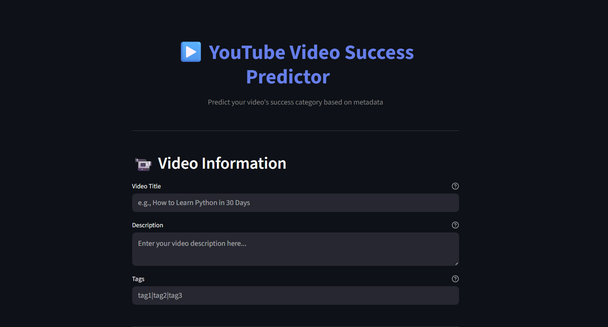
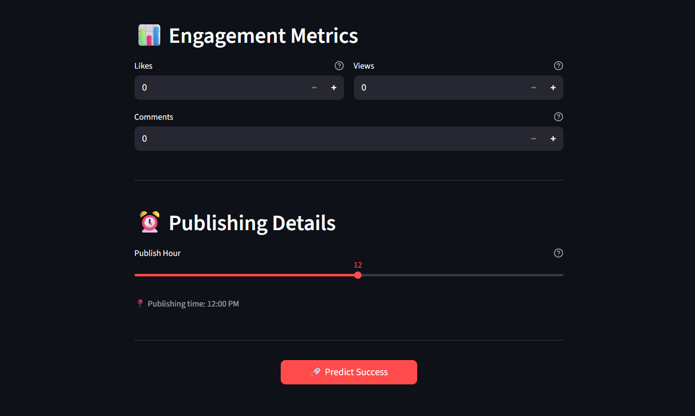
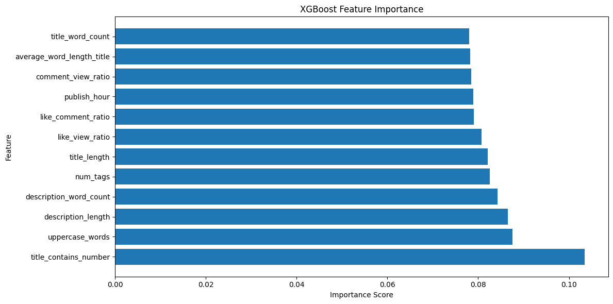

# 🎥 YouTube Video Success Predictor

A full-stack Machine Learning web application that predicts the success category of a YouTube video using metadata such as title, description, tags, and engagement metrics.

This project demonstrates an end-to-end ML workflow including data preprocessing, feature engineering, model training, API development, and frontend deployment.

---

## 🚀 Project Overview

YouTube video performance depends on multiple factors such as engagement, publishing patterns, and content presentation.
This project builds a predictive model that classifies videos into success categories based on available metadata.

### 🎯 Prediction Categories

* **Low** — Less than 50K views
* **Medium** — 50K to 200K views
* **High** — 200K to 1M views
* **Viral** — More than 1M views

---

## 🧠 Machine Learning Pipeline

The project follows a structured ML workflow:

1. Data Understanding & Cleaning
2. Feature Engineering
3. Model Training using XGBoost
4. Model Evaluation
5. Feature Importance Analysis
6. API Integration (FastAPI)
7. Frontend Development (Streamlit)

---

## 🖥️ Application UI

### 🎬 Video Information & Input Interface



### 📊 Engagement Metrics & Publishing Details



---

## 📈 Model Feature Importance

The following graph shows the importance of engineered features used by the XGBoost model.



Key observations:

* Engagement ratios significantly influence prediction.
* Title characteristics and description length contribute strongly.
* Publishing hour has moderate impact on performance.

---

## ⚙️ Feature Engineering

### Text-Based Features

* Title length
* Description length
* Title word count
* Uppercase word count
* Average word length
* Title contains number

### Engagement Features

* Like-to-view ratio
* Comment-to-view ratio
* Like-to-comment ratio

### Time-Based Features

* Publish hour

---

## 🤖 Model Used

### XGBoost Classifier

Chosen because:

* Excellent performance on tabular datasets
* Handles non-linear relationships effectively
* Provides interpretable feature importance

Model accuracy achieved:

```
~60% baseline accuracy
```

---

## 🏗️ System Architecture

```
Streamlit Frontend
        ↓
FastAPI Backend
        ↓
XGBoost ML Model
```

---

## 🛠 Tech Stack

* Python
* Pandas
* NumPy
* Scikit-learn
* XGBoost
* FastAPI
* Streamlit
* Matplotlib
* Joblib
* VS Code

---

## 📁 Project Structure

```
youtube-video-success-predictor/
│
├── app/                # FastAPI backend & Streamlit frontend
├── notebook/           # Model development notebooks
├── models/             # Saved ML models
├── photos/             # UI screenshots & graphs
├── README.md
└── .gitignore
```

---

## 🔮 Future Improvements

* Neural network with text embeddings
* Sentence Transformer integration
* Confidence score visualization
* User authentication
* Cloud deployment

---

## 👨‍💻 Author

**Arya Tiwari**
B.Tech CSE | Machine Learning & Full Stack Development
